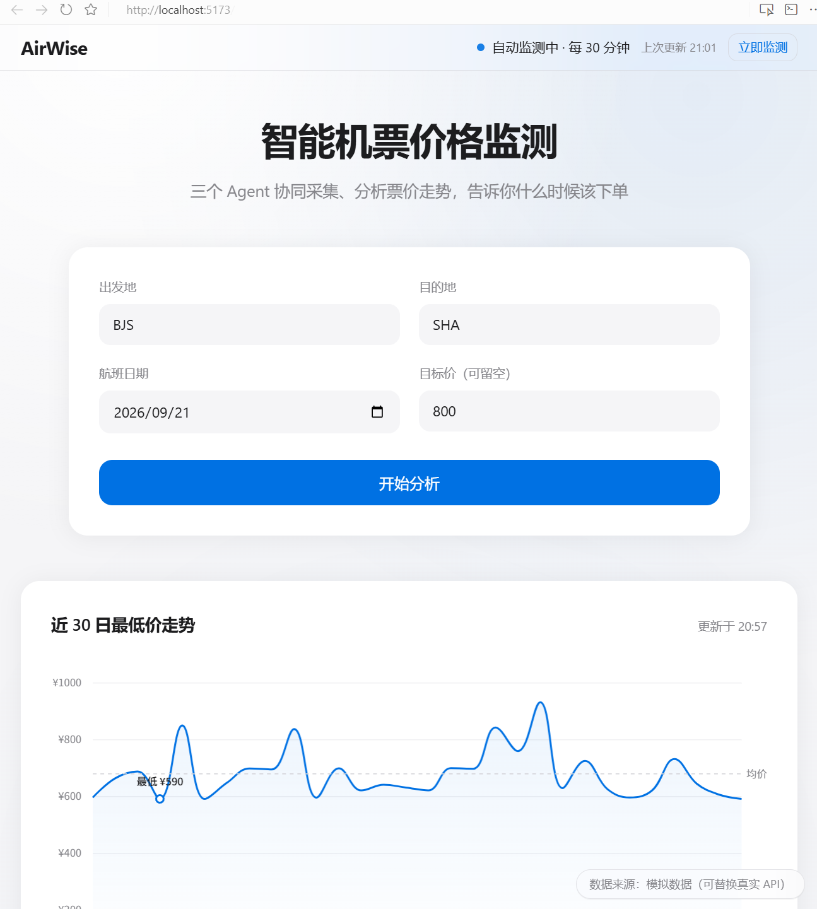
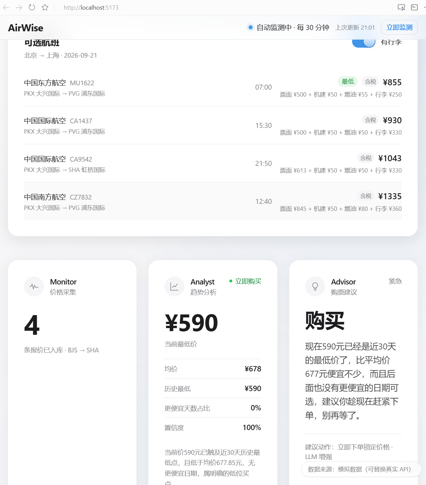
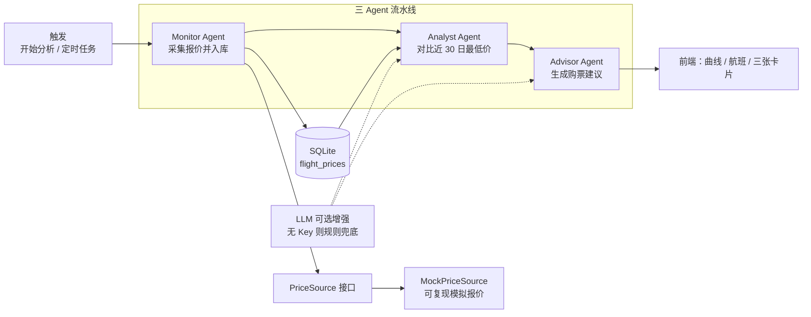

# AirWise

[](https://www.python.org/)
[](https://fastapi.tiangolo.com/)
[](https://react.dev/)
[](https://www.typescriptlang.org/)
[](https://vitejs.dev/)
[](#免责声明)

机票价格监测 Web App：用三个 Agent 采集、判断、建议，告诉你当前价位是否值得下手。

机票价格每天都在变，普通人很难判断「现在买贵不贵」。AirWise 把近 30 日最低价画成曲线，再给出明确信号（立即购买 / 可以考虑 / 继续等待）。**当前票价来自内置模拟数据源，用于稳定可复现的演示，不是真实在售价格。**



<p align="center"><sub>主界面：近 30 日价格曲线、Monitor / Analyst / Advisor 三张卡片，以及含税费明细的航班列表。</sub></p>



<p align="center"><sub>行李开关细节：拨动「有行李 / 无行李」时，含税总价与税费明细同步变化。</sub></p>

---

## 功能特性

### 核心能力

- **三 Agent 流水线**：Monitor 采集报价 → Analyst 判断水位 → Advisor 给出购票建议
- **价格曲线**：近 30 日每日最低价，含均价虚线与最低点标注
- **可选航班列表**：航司中文名 + 航班号、起降机场、起飞时间、含税总价与税费明细
- **自动监测**：启动后按间隔对关注航线（BJS–SHA / BJS–CTU / SHA–CAN）定时采集；顶栏可查看状态并手动触发
- **历史回填**：启动时若某关注航线不足 30 天，自动补齐；也可调用 `POST /api/monitor/backfill`
- **规则分析兜底**：未配置 LLM Key 时，Analyst / Advisor 仍用规则引擎给出信号与文案；配了 Key 则用 DeepSeek 改写说明（失败自动降级）

### 体验细节

- 城市搜索：中文名 / 拼音 / 三字码均可匹配
- 行李偏好开关：切换「含行李 / 不含行李」总价，税费明细同步更新
- 顶栏监测状态：运行中 / 上次执行时间 /「立即监测」
- Apple 风格界面：毛玻璃顶栏、卡片阴影、数字等宽，不引入第三方 UI 库

---

## 技术栈

| 分层 | 技术 |
| --- | --- |
| 后端 | Python 3.10+、FastAPI、Uvicorn、SQLAlchemy、Pydantic Settings、APScheduler |
| 前端 | React 18、TypeScript 5、Vite 5、Tailwind CSS 3、ECharts |
| 数据 | SQLite（默认 `backend/airwise.db`）、启动自动建表 |
| LLM | OpenAI 兼容接口（默认 DeepSeek）。**未配置 Key 时完整功能仍可跑通** |

> `requirements.txt` 中仍列有 LangChain，当前代码未引用；LLM 调用走 `openai` SDK。

---

## 架构说明

三个 Agent 由 `AgentOrchestrator` 串成一条流水线。页面点「开始分析」走完整链路；定时任务只跑 Monitor。Analyst 读的是**截止今天**的每日最低价，不把「今天 + 10 天」的未来航班日期混进曲线。



| Agent | 职责 | 输出 |
| --- | --- | --- |
| **Monitor** | 向 `PriceSource` 拉某航线某日报价，写入 `flight_prices` | 入库条数、航线 |
| **Analyst** | 用每日最低价算当前价、均价、历史最低、更便宜天数占比 | 信号 `buy_now` / `consider` / `wait`，以及中文原因 |
| **Advisor** | 结合信号与可选目标价，写成口语建议 | 建议（购买 / 观望 / 继续监控）、紧急度、建议动作 |

数据源与 Agent 解耦：换官方 API 时实现 `PriceSource` 并注入 Monitor，不必改分析与建议逻辑。

---

## 10 分钟极速复现

环境：**Python 3.10+**、**Node.js 18+**。先起后端（8000），再起前端（5173）。LLM Key **不是**必填项。

### 1. 后端

在项目根目录打开终端：

```bash
cd backend
python -m venv .venv
```

Windows：

```bat
.venv\Scripts\activate
pip install -r requirements.txt
copy .env.example .env
uvicorn app.main:app --reload --port 8000
```

macOS / Linux：

```bash
source .venv/bin/activate
pip install -r requirements.txt
cp .env.example .env
uvicorn app.main:app --reload --port 8000
```

启动后会：建表（或补列）→ 关注航线不足 30 天则回填 → 约 10 秒后跑第一次定时监测。数据库文件是 `backend/airwise.db`。

若改过表结构、希望从空库开始：先停后端，删除 `backend/airwise.db`，再启动一次即可自动建表并回填。

### 2. 前端

另开一个终端：

```bash
cd frontend
npm install
npm run dev
```

Vite 已把 `/api` 代理到 `http://localhost:8000`。

### 3. 验收清单

按顺序核对，全部通过即复现成功：

| # | 操作 | 成功标准 |
| --- | --- | --- |
| 1 | 打开 [http://localhost:8000/api/health](http://localhost:8000/api/health) | JSON：`{"status":"ok","app":"AirWise","version":"0.1.0"}` |
| 2 | 打开 [http://localhost:8000/docs](http://localhost:8000/docs) | FastAPI Swagger 可浏览接口 |
| 3 | 打开 [http://localhost:8000/api/routes/BJS/SHA/history?days=30](http://localhost:8000/api/routes/BJS/SHA/history?days=30) | 约 30 条 `{date, min_price}`，日期连续、价格有起伏 |
| 4 | 打开 [http://localhost:5173](http://localhost:5173) | 看到「智能机票价格监测」与查询卡片；右下角「数据来源：模拟数据」 |
| 5 | 顶栏右侧 | 「监测中」或类似状态；可点「立即监测」 |
| 6 | 默认 BJS → SHA，点「开始分析」 | 曲线出现走势（不是一条水平线）；下方航班列表有航司名 + 航班号 + 机场 + 含税价 |
| 7 | 拨动「有行李 / 无行李」 | 总价变化，明细中行李项出现或消失 |
| 8 | 三张 Agent 卡片 | Monitor 有入库条数；Analyst 有当前最低价与信号；Advisor 有中文建议 |

可选：不填 `LLM_API_KEY` 再分析一次，卡片仍有规则文案，且 `llm_used` 应为 false（可在浏览器 Network 里看 `/api/agents/run` 响应）。

---

## 环境变量

复制 `backend/.env.example` 为 `backend/.env`。在 `backend/` 目录启动时由 pydantic-settings 读取。

| 变量 | 说明 | 示例 | 必填 |
| --- | --- | --- | --- |
| `APP_NAME` | 应用名 | `AirWise` | 否 |
| `APP_VERSION` | 版本号 | `0.1.0` | 否 |
| `DATABASE_URL` | SQLAlchemy 连接串 | `sqlite:///./airwise.db` | 否 |
| `LLM_API_KEY` | DeepSeek（或兼容服务）Key；空则走规则引擎 | `sk-...` | 否 |
| `LLM_BASE_URL` | OpenAI 兼容 Base URL | `https://api.deepseek.com/v1` | 否 |
| `LLM_MODEL` | 模型名 | `deepseek-chat` | 否 |
| `MONITOR_INTERVAL_MINUTES` | 自动监测间隔（分钟），最小按 1 生效 | `30` | 否 |
| `OPENAI_API_KEY` | 配置项预留，**当前代码未使用** | （空） | 否 |

---

## 目录结构

```
AirWise/
├── backend/
│   ├── app/
│   │   ├── main.py              # FastAPI 入口：CORS、建表、回填、调度器生命周期
│   │   ├── config.py            # 环境变量
│   │   ├── db.py                # Engine / Session / Base
│   │   ├── models.py            # FlightPrice
│   │   ├── queries.py           # 每日最低价聚合
│   │   ├── backfill.py          # 历史回填
│   │   ├── scheduler.py         # 关注航线定时监测
│   │   ├── api/router.py        # REST 接口
│   │   ├── agents/              # Monitor / Analyst / Advisor / Orchestrator
│   │   ├── sources/             # PriceSource 抽象 + MockPriceSource
│   │   └── llm/                 # OpenAI 兼容客户端
│   ├── requirements.txt
│   └── .env.example
├── frontend/
│   ├── src/
│   │   ├── App.tsx              # 查询、拉数、三张 Agent 卡片
│   │   ├── PriceChart.tsx       # 30 日曲线
│   │   ├── cities.ts            # 城市搜索数据
│   │   ├── airports.ts          # 机场三字码 → 中文名
│   │   └── components/          # 航班列表、行李开关、顶栏监测等
│   ├── package.json
│   └── vite.config.ts           # 开发服务器：/api → :8000
├── docs/
│   ├── prompts/                 # 每日实现记录
│   └── screenshots/             # 界面与过程截图
└── README.md
```

---

## API 接口

基础地址：`http://localhost:8000`。

| 方法 | 路径 | 说明 |
| --- | --- | --- |
| `GET` | `/api/health` | 健康检查 |
| `GET` | `/api/ping` | 连通探测，返回 `pong` |
| `POST` | `/api/monitor/run` | 采集一条航线某日报价并入库 |
| `POST` | `/api/monitor/backfill` | 回填历史；body 可空（默认关注航线、30 天）；可指定 `origin` / `destination` / `days` |
| `GET` | `/api/routes/{origin}/{destination}/prices` | 某日航班报价列表（需 `flight_date`） |
| `GET` | `/api/routes/{origin}/{destination}/history` | 近 N 日每日最低价（默认 `days=30`，含今天、不含未来航班日） |
| `GET` | `/api/insights/{origin}/{destination}` | 仅用已有历史跑 Analyst + Advisor，不采集 |
| `POST` | `/api/agents/run` | 完整流水线：采集 → 分析 → 建议 |
| `GET` | `/api/scheduler/status` | 调度器状态与最近执行记录 |
| `POST` | `/api/scheduler/run-now` | 对全部关注航线立即监测一次 |

`POST /api/agents/run` 请求示例：

```json
{
  "origin": "BJS",
  "destination": "SHA",
  "flight_date": "2026-09-21",
  "target_price": 800
}
```

交互式文档：[http://localhost:8000/docs](http://localhost:8000/docs)

---

## 数据来源说明

**当前使用内置模拟数据源（`MockPriceSource`），不是航司或 OTA 的实时报价。**

- 按航线给定票面价区间（例如 BJS–SHA 约 500–1200 元），叠加机建费 50 元、按航程分档的燃油附加费，以及含 / 不含行李两档总价
- 同一「航线 + 航班日期」使用固定随机种子，结果可复现，便于评审对照
- 航司为三家：中国国际航空、中国东方航空、中国南方航空；北京 / 上海 / 成都等会在同城多机场之间分配三字码

架构上票价来自抽象接口 `PriceSource`。生产环境可替换为已获授权的官方或合作方 API，Monitor / Analyst / Advisor 无需改流程。

这样做是因为：公开抓取在售机票通常受网站条款与合规限制；比赛与演示需要**不依赖外部账号、断网也能复现**的数据。模拟源保证评委按 README 启动后，曲线、航班列表与 Agent 结论都能稳定出现。

页面右下角有「数据来源：模拟数据（可替换真实 API）」标识。

---

## 免责声明

AirWise 仅供学习、比赛演示与交互设计展示。

- 列表中的航班、时刻、票面价、税费与行李费均为程序生成，**不能用于真实购票或比价**
- 分析信号与建议基于上述模拟历史，不构成投资或消费建议
- 未对接任何航司、OTA 或支付渠道；本仓库不提供出票能力
- 使用或传播时请同时保留本说明，避免被理解为真实机票产品
